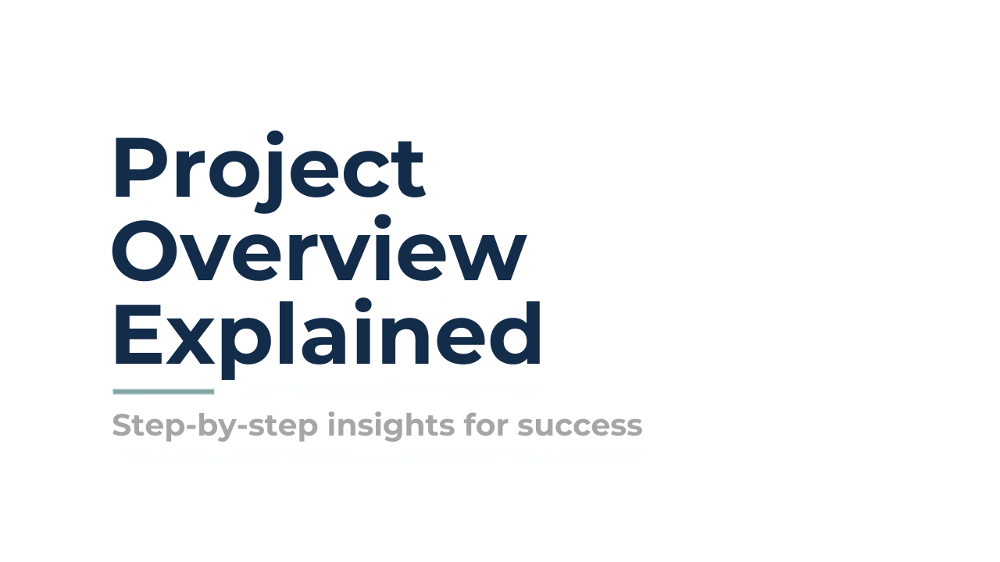
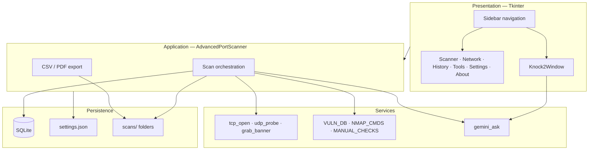
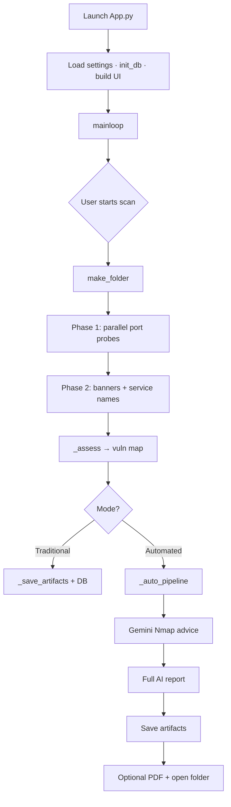

# Advanced Port Scanner v5.0

**Desktop security assessment tool** — scan ports, map common risks, generate AI reports, and export professional artifacts.

Built with **Python · Tkinter · SQLite · Google Gemini** for [Supraja Technologies](https://www.suprajatechnologies.com) Cyber Security Cell.

> **Authorized use only.** Scan systems you own or have written permission to test.

---

## Table of Contents

- [Overview](#overview)
- [Key Features](#key-features)
- [Technology Stack](#technology-stack)
- [Architecture](#architecture)
- [Project Structure](#project-structure)
- [Installation](#installation)
- [Usage](#usage)
- [Configuration](#configuration)
- [Build & Packaging](#build--packaging)
- [Screenshots](#screenshots)
- [Troubleshooting](#troubleshooting)
- [Developer Information](#developer-information)
- [Roadmap](#roadmap)
- [Contributing](#contributing)
- [Disclaimer](#disclaimer)

---

## 🎥 AI Project Overview

This repository includes an AI-generated project walkthrough created from the project's documentation. It provides a high-level explanation of the application's architecture, features, workflow, and implementation.

[](docs/project-overview.mp4)

> 🎙️ Generated using Google NotebookLM
> ⏱️ Duration: 10 minutes

## Overview

Advanced Port Scanner is a **single-window desktop GUI** (`App.py`) for authorized network assessment. It finds open TCP/UDP ports, identifies services via banners, maps findings to a built-in vulnerability knowledge base, and can produce Gemini-assisted security reports plus CSV/PDF exports.

| Audience | What you get |
|----------|----------------|
| **End users** | Point-and-click scanning, LAN discovery, Knock-2 AI chat, PDF reports |
| **Recruiters / reviewers** | Full-stack desktop app: concurrency, persistence, optional AI, packaging path |

**Runtime data** (created on first launch):

```text
~/Documents/Advanced_Port_Scanner/
├── scanner.db       # Scan history + Knock-2 chat
├── settings.json    # Preferences
└── scans/           # Per-scan JSON / logs / PDFs
```

---

## Key Features

| Area | What it does |
|------|----------------|
| **Port scanner** | IP or domain target · port ranges or 0–65535 · TCP / UDP / BOTH · Traditional or Automated mode · stoppable live progress |
| **Prompt bar** | Natural-language fill (`Parse`) or Gemini JSON extract (`AI Parse`) |
| **Assessment** | Static `VULN_DB` (CVE / severity / mitigation) + banner heuristics · suggested Nmap & manual checks |
| **Port detail** | Double-click → live tests, vuln list, Nmap commands, on-demand AI |
| **My Network** | CIDR host discovery (ping, hostname, ARP MAC, common ports) · ping / traceroute / nslookup / ARP / netstat / portcheck |
| **Knock-2 AI** | Cybersecurity-only Gemini chatbot with SQLite history |
| **Tools** | Curated OSINT links + quick domain lookups in the browser |
| **History** | Restore past scans from SQLite |
| **Export** | CSV · security PDF · mitigation PDF (ReportLab) · Automated auto-save |

---

## Technology Stack

| Layer | Technologies |
|-------|----------------|
| **Language** | Python 3 (packaged historically with 3.13) |
| **UI** | Tkinter / ttk |
| **Networking** | `socket`, `ipaddress`, `subprocess` (ping/ARP/traceroute), optional `requests` / `ftplib` / `smtplib` |
| **Concurrency** | `threading`, `concurrent.futures.ThreadPoolExecutor` |
| **Storage** | SQLite (`scanner.db`), JSON settings & scan artifacts |
| **AI** | Google Gemini via `google-generativeai` (models tried in order: `gemini-2.5-flash`, `gemini-2.0-flash`, `gemini-1.5-flash`, `gemini-1.5-pro`) |
| **Reports** | `reportlab` (A4 PDF), CSV via stdlib |
| **Packaging** | PyInstaller (see `build/` artifacts; prior output: `dist/app.exe`) |

**PyPI packages used by the app:** `requests`, `reportlab`, `google-generativeai`  
**Packaging helper only:** `python-dotenv` (used by `build.py`, not imported by `App.py`)

Missing optional packages disable related features; core TCP scanning still runs.

---

## Architecture



**Design notes (from code):**
- Monolith: UI + logic live in `App.py`
- Background work uses daemon threads; UI updates via `root.after(...)`
- Host port sweep: up to **512** workers · LAN sweep: up to **128** workers

### Application flow



---

## Project Structure

```text
Advance port scanner/
├── App.py                 # Application entry point (all features)
├── build.py               # Dotenv loader helper for frozen/PyInstaller runs
├── .env                   # Local GOOGLE_API_KEY (do not commit secrets)
├── README.md
└── build/app/             # Generated PyInstaller analysis (not source)
    ├── Analysis-00.toc
    ├── EXE-00.toc         # Prior build targeted dist/app.exe (onefile)
    ├── warn-app.txt
    └── …
```

**Per-scan folder contents** (written by `_save_artifacts` / Automated pipeline):

| File | When |
|------|------|
| `scan_info.json`, `open_ports.json`, `vulnerabilities.json`, `nmap_commands.json` | After scan |
| `logs.txt`, `errors.txt` | After scan |
| `nmap_commands.txt`, `ai_report.txt` | Automated / AI report |
| `security_report.pdf`, `mitigation_report.pdf` | Automated + `auto_save_pdf` |

---

## Installation

### Option A — Run from source (recommended for development)

**Requirements:** Python 3 with Tkinter · network access for targets (and Gemini if used)

```bash
# 1. Clone
git clone <your-repo-url>
cd "Advance port scanner"

# 2. Virtual environment
python -m venv .venv
.venv\Scripts\activate          # Windows
# source .venv/bin/activate     # macOS / Linux

# 3. Dependencies
pip install requests reportlab google-generativeai

# 4. Run
python App.py
```

Optional `.env` in the project root:

```env
GOOGLE_API_KEY=your_key_here
```

### Option B — Portable Windows executable

This repository **does not currently ship a prebuilt `.exe`**. Historical PyInstaller output was a **one-file** portable binary (`dist/app.exe`). Build your own:

1. Follow [Build & Packaging](#build--packaging)
2. Run the generated EXE from `dist/` — no Python install required on the target PC
3. User data still goes to `Documents\Advanced_Port_Scanner\`

### Option C — Windows installer

**Not included in this repository** (no `.msi` / Inno Setup / NSIS project). Typical release approach:

1. Build the portable one-file EXE
2. Wrap it with a third-party installer (e.g. Inno Setup) that copies the EXE and creates a Start Menu shortcut

Until that packaging is added, distribute the **portable EXE** or run from source.

---

## Usage

### Port scan

1. Open **Scanner**
2. Enter **Domain** → **Resolve →**, or type an **IP**
3. Set start/end ports (or **Scan All Ports**)
4. Choose **Protocol** and **Mode**
5. **▶ Start Scan** · **■ Stop** to abort
6. Double-click a row for checks / vulns / Nmap AI
7. Use **Generate Report**, **Save PDF**, **Mitigation PDF**, or **⬇ CSV** as needed

**Prompt example:** `scan 192.168.1.1 ports 80-443` → **Parse** or **AI Parse**

**Automated mode** after discovery: Gemini Nmap advice → full AI report → artifacts → optional PDF + folder open (Settings).

### My Network

1. Confirm CIDR (defaults from local `/24`)
2. Sweep hosts · select a device · run tools or **AI advice**

### Knock-2 AI

Sidebar **Knock-2 AI** → cybersecurity Q&A (history persisted).

### History

**History** → double-click a row to restore that scan session into Scanner.

---

## Configuration

Set most options in **Settings → Save All Settings**.

### API key priority (`get_api_key`)

1. `settings.json` → `gemini_api_key`
2. Environment variable `GOOGLE_API_KEY`
3. Project `.env` → `GOOGLE_API_KEY=`

### `settings.json` keys

| Key | Default | Purpose |
|-----|---------|---------|
| `gemini_api_key` | `""` | Gemini key |
| `scans_folder` | `…/Documents/Advanced_Port_Scanner/scans` | Artifact root |
| `auto_save_pdf` | `true` | PDFs after Automated scans |
| `auto_open_folder` | `true` | Open folder after Automated scans |
| `assessor_name` | `"Security Analyst"` | Reports / PDF footer |
| `default_proto` | `"TCP"` | `TCP` · `UDP` · `BOTH` |
| `default_mode` | `"Traditional"` | `Traditional` · `Automated` |
| `theme_accent` | `"#00ff88"` | Accent color read at startup |

> `theme_accent` is loaded at launch; the Settings “Save All” path does not currently edit it in the UI (`colorchooser` is imported but unused).

---

## Build & Packaging

Evidence in `build/app/` shows a prior **PyInstaller one-file** build of `App.py` → `dist/app.exe` (Python 3.13, Windows).

### Produce a portable EXE (Windows)

```powershell
python -m venv .venv
.\.venv\Scripts\activate
pip install requests reportlab google-generativeai pyinstaller python-dotenv

pyinstaller --noconfirm --onefile --windowed `
  --name "AdvancedPortScanner" `
  App.py
```

Output: `dist\AdvancedPortScanner.exe`

Optional: include a **template** `.env` (never real secrets):

```powershell
pyinstaller --noconfirm --onefile --windowed `
  --name "AdvancedPortScanner" `
  --add-data ".env;." `
  App.py
```

`build.py` resolves paths under `sys._MEIPASS` when frozen and loads `.env` via `python-dotenv`. **`App.py` already reads `.env` itself** for `GOOGLE_API_KEY`; wire `build.py` into your frozen entry only if you choose that packaging style.

### Tips

- Prefer `--windowed` for a GUI app (no console)
- After build, check `build/*/warn-*.txt` for missing modules
- Do not ship API keys inside the binary

---

## Screenshots

Add captures under `docs/screenshots/` when available:

| | |
|--|--|
|  |  |
|  |  |

---

## Troubleshooting

| Issue | What to check |
|-------|----------------|
| **App won’t start** | Python installed · Tkinter available (`python -m tkinter`) · run `python App.py` from the project folder |
| **“Cannot resolve” domain** | DNS / spelling · try IP directly |
| **No open ports** | Target reachable · firewall · try a known open port range · UDP often false-negatives (timeout-based) |
| **Gemini / Knock-2 errors** | `pip install google-generativeai` · set key in Settings / `.env` · use **Test Key** · quota (`429`) retries are built in |
| **PDF buttons fail** | `pip install reportlab` |
| **Weak HTTP banners** | `pip install requests` |
| **Scan feels stuck** | Large ranges use many threads · use **Stop** · narrow the port range |
| **Where are my files?** | `Documents\Advanced_Port_Scanner\` (or custom folder in Settings) |

---
