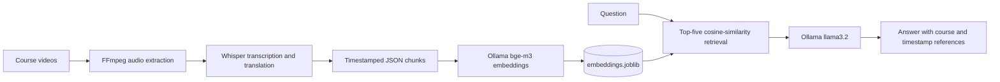

# RAG-Based AI Course Assistant

A command-line retrieval-augmented generation prototype for answering questions about video-course content. It transcribes course audio into timestamped text, embeds the transcript chunks with Ollama, retrieves the five most similar chunks for a question, and asks a local language model to generate an answer with video and timestamp references.

## Table of Contents

- [Pipeline](#pipeline)
- [Technology Stack](#technology-stack)
- [Project Structure](#project-structure)
- [Requirements](#requirements)
- [Installation](#installation)
- [Prepare Course Files](#prepare-course-files)
- [Run the Pipeline](#run-the-pipeline)
- [Ask a Question](#ask-a-question)
- [How Retrieval Works](#how-retrieval-works)
- [Limitations](#limitations)

## Pipeline



## Technology Stack

| Area | Technology |
|------|------------|
| Language | Python |
| Video/audio conversion | FFmpeg |
| Speech transcription | OpenAI Whisper (`large-v2`) |
| Local model API | Ollama |
| Embeddings | Ollama `bge-m3` |
| Answer generation | Ollama `llama3.2` |
| Retrieval and storage | pandas, scikit-learn, NumPy, joblib |

## Project Structure

```text
RAG-based-ai/
├── videos/                 # Input videos; create this directory
├── audios/                 # Extracted MP3 files; create this directory
├── jsons/                  # Timestamped transcripts; create this directory
├── video_to_mp3.py         # Extracts audio from videos
├── mp3_to_json.py          # Transcribes and translates audio
├── preprocess_json.py      # Embeds transcript chunks
├── process_incoming.py     # Retrieves context and generates an answer
├── embeddings.joblib       # Serialized transcript and embeddings
├── prompt.txt              # Prompt for the latest question
└── response.txt            # Answer to the latest question
```

## Requirements

- Python 3
- FFmpeg installed and available on `PATH`
- Ollama running locally at `http://localhost:11434`
- Ollama models `bge-m3` and `llama3.2`
- Python packages: `openai-whisper`, `requests`, `pandas`, `numpy`, `scikit-learn`, and `joblib`

Whisper downloads the `large-v2` model the first time it runs. Transcription can require substantial disk space and CPU/GPU resources.

## Installation

Create and activate a virtual environment, then install the Python dependencies:

```bash
python -m venv .venv
```

Windows PowerShell:

```powershell
.venv\Scripts\Activate.ps1
python -m pip install openai-whisper requests pandas numpy scikit-learn joblib
```

macOS or Linux:

```bash
source .venv/bin/activate
python -m pip install openai-whisper requests pandas numpy scikit-learn joblib
```

Install FFmpeg and Ollama separately. Download the models with:

```bash
ollama pull bge-m3
ollama pull llama3.2
```

Start Ollama before running the embedding or question-answering scripts.

## Prepare Course Files

Run every script from the project root. Create the `videos/`, `audios/`, and `jsons/` directories; the scripts do not create these directories automatically.

Place course videos in `videos/`. The video parser expects filenames in a pattern such as:

```text
Course #1 [Introduction] ｜ source-video.mp4
```

The parser uses the number after `#`, the bracketed title segment, and the full-width separator `｜` to construct audio metadata. Keep this naming pattern consistent.

## Run the Pipeline

Run these commands in order:

```bash
python video_to_mp3.py
python mp3_to_json.py
python preprocess_json.py
python process_incoming.py
```

The first command writes MP3 files to `audios/`. Whisper processes those files and writes timestamped transcript JSON files to `jsons/`. The preprocessing step calls Ollama to embed the transcript chunks and saves `embeddings.joblib`.

## Ask a Question

After the transcript embeddings have been generated, start the final script:

```bash
python process_incoming.py
```

Enter a question about the course when prompted. The script retrieves up to five relevant transcript chunks, writes the assembled prompt to `prompt.txt`, prints the Ollama response, and saves it to `response.txt`. These output files are overwritten by the next question.

## How Retrieval Works

Each transcript segment is stored with its course number, title, start/end time, text, and embedding. The question is embedded with `bge-m3`; cosine similarity selects the five closest transcript chunks. The selected records are placed in a prompt sent to `llama3.2`, which is instructed to answer course-related questions and identify useful videos and timestamps.

## Limitations

- This is a local prototype, not a hosted service or interactive web application.
- Transcription is configured for Hindi input translated to English.
- The filename parser depends on a specific naming pattern and may fail on other formats.
- The scripts use relative paths and must be run from this project directory.
- Ollama/network errors and malformed responses are not handled comprehensively.
- `embeddings.joblib`, `prompt.txt`, and `response.txt` represent local generated state; regenerate embeddings after changing transcript files.
