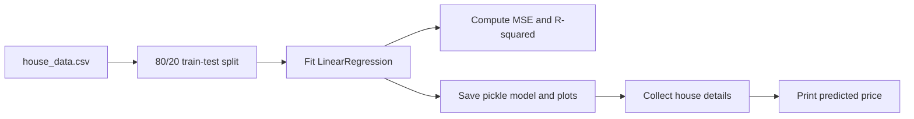

# House Price Prediction with Linear Regression

A terminal-based machine-learning project that trains a scikit-learn linear regression model on a small house-price dataset, evaluates it, saves the trained model, and predicts prices from interactive user input.

## Table of Contents

- [Overview](#overview)
- [Features](#features)
- [Technology Stack](#technology-stack)
- [Project Structure](#project-structure)
- [Dataset](#dataset)
- [Installation](#installation)
- [Train and Evaluate](#train-and-evaluate)
- [Make a Prediction](#make-a-prediction)
- [Model Workflow](#model-workflow)
- [Limitations](#limitations)

## Overview

The model uses house area, number of bedrooms, and house age to estimate price. The training script loads `data/house_data.csv`, creates an 80/20 train/test split, reports mean squared error and R-squared, and saves a fitted model for later use.

## Features

- Train a linear regression model from CSV data
- Evaluate the held-out test split with MSE and R-squared
- Save the trained estimator with Python `pickle`
- Generate actual-versus-predicted and coefficient plots
- Collect and validate prediction inputs in the terminal

## Technology Stack

| Area | Technology |
|------|------------|
| Language | Python |
| Data handling | pandas, NumPy |
| Model and metrics | scikit-learn |
| Charts | Matplotlib |
| Model persistence | Python `pickle` |

## Project Structure

```text
linear_regression_project/
├── data/
│   └── house_data.csv             # Training dataset
├── models/
│   └── linear_model.pkl           # Trained model (created/updated by training)
├── plots/                         # Training charts (created by training)
├── src/
│   ├── train_model.py             # Training, evaluation, and artifact generation
│   └── predict.py                 # Interactive terminal prediction
├── requirements.txt
└── README.md
```

## Dataset

The CSV file is `data/house_data.csv` and must include these columns:

| Column | Use |
|--------|-----|
| `area` | House area in square feet |
| `bedrooms` | Number of bedrooms |
| `age` | House age in years |
| `price` | Target price used during training |

The first three columns are the model features; `price` is the target.

## Installation

Requires Python 3. Install the packages from the project directory:

```bash
python -m venv .venv
```

Windows PowerShell:

```powershell
.venv\Scripts\Activate.ps1
python -m pip install -r requirements.txt
```

macOS or Linux:

```bash
source .venv/bin/activate
python -m pip install -r requirements.txt
```

## Train and Evaluate

Run training from the project root:

```bash
python src/train_model.py
```

On completion, the script writes or replaces `models/linear_model.pkl` and creates:

- `plots/actual_vs_predicted.png`
- `plots/feature_importance.png` (absolute regression coefficients; not a normalized feature-importance measure)

The test split is 20% of the data and uses `random_state=42`.

## Make a Prediction

Train the model first if `models/linear_model.pkl` is missing. Then run:

```bash
python src/predict.py
```

Enter the house area, bedroom count, and age when prompted. The script requires a positive area and non-negative integer values for bedrooms and age, then prints the predicted price.

## Model Workflow



## Limitations

- The dataset is small and is suitable for demonstrating a workflow, not for reliable real-world valuation.
- Predictions are only as representative as the training data and can be inaccurate outside its range.
- The coefficient chart compares raw coefficient magnitudes even though the features use different units.
- Only load the `.pkl` model file from a trusted source; unpickling an untrusted file can execute code.
- No automated tests are configured in this project.
