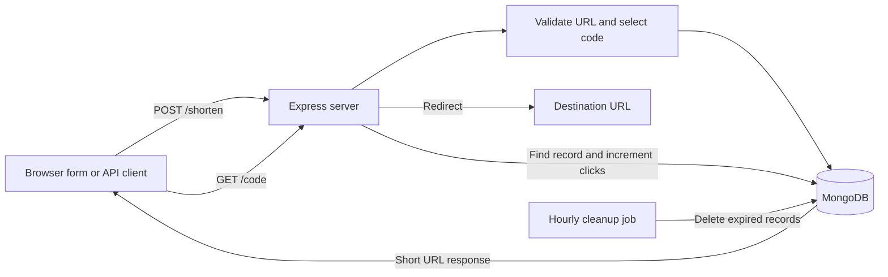

# URL Shortener

A small full-stack URL shortener built with **Node.js, Express, and MongoDB**. Create short links from a browser form or JSON API, optionally choose a custom alias, and redirect visitors to the saved destination.

## Table of Contents

- [Overview](#overview)
- [Features](#features)
- [Technology Stack](#technology-stack)
- [How It Works](#how-it-works)
- [Project Structure](#project-structure)
- [Requirements](#requirements)
- [Installation](#installation)
- [Usage](#usage)
- [API](#api)
- [Data Model](#data-model)
- [Configuration](#configuration)
- [Known Limitations](#known-limitations)
- [Testing](#testing)

## Overview

The app serves a simple web page for shortening links and an Express API. Short links are stored in MongoDB. Opening a short link looks up its destination, increments its click count, and redirects the visitor.

The application listens on port `3000` and connects to a local MongoDB instance.

## Features

- Generate short codes using a Base62 alphabet
- Choose an optional custom alias
- Reuse an existing short link for a repeated destination when no alias is supplied
- Validate destination URLs before saving
- Redirect short links and count visits
- Set an optional expiry period through the API
- Reject expired links and periodically remove expired records
- Limit requests to 20 per IP per 15-minute window
- Serve a basic HTML form from Express

## Technology Stack

| Area | Technology |
|------|------------|
| Runtime | Node.js (CommonJS) |
| HTTP server | Express 5 |
| Database | MongoDB with Mongoose |
| Rate limiting | `express-rate-limit` |
| Expiration cleanup | `node-cron` |
| Frontend | HTML, CSS, and browser Fetch API |

## How It Works



Generated codes are created by Base62-encoding a value based on the current time plus a random offset. The server checks MongoDB for an existing code before saving it.

## Project Structure

```text
url-shortener/
├── config/
│   └── db.js                 # MongoDB connection
├── jobs/
│   └── cleanupExpired.js     # Hourly cleanup of expired links
├── middleware/
│   └── rateLimiter.js        # Global request rate limit
├── models/
│   └── urlModel.js           # Mongoose URL schema
├── public/
│   └── index.html            # Browser form
├── routes/
│   └── urlRoutes.js          # Create, redirect, and analytics routes
├── utils/
│   ├── base62.js             # Base62 encoder
│   ├── generateShortCode.js  # Short-code generator
│   └── validateUrl.js        # URL validation
├── server.js                 # Application entry point
├── package.json
└── package-lock.json
```

## Requirements

- Node.js and npm
- MongoDB running locally at `mongodb://127.0.0.1:27017`

## Installation

From the project directory, install dependencies:

```bash
npm install
```

Start MongoDB, then start the application:

```bash
node server.js
```

The server listens on port `3000`. Open [http://localhost:3000](http://localhost:3000) in a browser to use the form.

## Usage

1. Enter a destination URL including its scheme, such as `https://example.com/page`.
2. Optionally enter a custom alias.
3. Select **Shorten**.
4. Open the generated short link to redirect to the destination.

The browser form sends `longUrl` and `customCode`. Expiry is currently available only through the API using `expiryDays`.

## API

### Create a short URL

`POST /shorten`

Request body:

```json
{
  "longUrl": "https://example.com/articles/getting-started",
  "customCode": "getting-started",
  "expiryDays": 30
}
```

`customCode` and `expiryDays` are optional. Omit `customCode` or send an empty value to generate a code.

Successful response:

```json
{
  "shortUrl": "http://localhost:3000/getting-started"
}
```

If the same destination has already been shortened without a custom alias, the existing short URL is returned with the message `URL already shortened`.

Common errors include `400` for an invalid URL or an already-used custom alias, and `500` for a server error.

### Redirect to a destination

`GET /:code`

A valid, unexpired code increments its click count and responds with an HTTP redirect. An unknown code returns `404`; an expired link returns `410`.

### Read link analytics

`GET /analytics/:code`

This route is intended to return the stored URL record, including destination, click count, creation time, and expiry. It is currently affected by the route-order limitation described below.

## Data Model

The Mongoose model stores URL documents with these fields:

| Field | Type | Description |
|-------|------|-------------|
| `shortCode` | String | Required and unique short-link code |
| `longUrl` | String | Required destination URL |
| `clicks` | Number | Redirect count; defaults to `0` |
| `expiry` | Date or `null` | Optional expiration time |
| `createdAt` | Date | Automatically added by Mongoose timestamps |
| `updatedAt` | Date | Automatically added by Mongoose timestamps |

## Configuration

The current implementation hard-codes these settings:

- MongoDB URI: `mongodb://127.0.0.1:27017/urlShortener`
- HTTP port: `3000`
- Rate limit: 20 requests per IP per 15 minutes
- Expired-link cleanup: once per hour

There is no environment-variable configuration yet.

## Known Limitations

- The generic `GET /:code` route is registered before `GET /analytics/:code`. Express can match `/analytics/:code` as `/:code` first, so analytics requests may be treated as redirects for the code `analytics` and return `404` instead of analytics data.
- The rate limiter is mounted globally and applies to static files, redirects, and API requests.
- MongoDB is fixed to a local instance; remote database configuration is not provided.
- Short-code collisions are checked before saving, but simultaneous requests are not retried after a database duplicate-key error.
- The package's `test` script is a placeholder; no automated test suite is configured.

## Testing

No automated tests are currently configured. The `npm test` command in `package.json` is a placeholder that exits with an error. To check the app manually, start MongoDB and the server, create a link from the browser form, and open the short URL.
